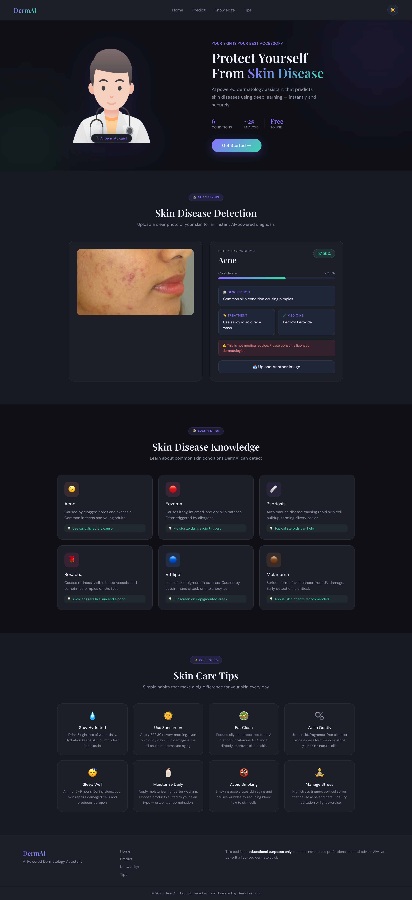

# 🩺 DermAI — AI-Powered Skin Disease Detector

   

An AI-powered dermatology web application that detects **6 skin conditions** from uploaded images using a CNN-based machine learning model, built with **React.js** and **Flask**.

> ⚠️ **Disclaimer:** This tool is for educational purposes only and does not replace professional medical advice. Always consult a certified dermatologist.

---

## 🖼️ Demo



---

## ✨ Features

- 📸 **Drag & Drop Image Upload** — Upload skin images instantly
- 🤖 **AI Skin Disease Detection** — CNN model predicts condition in real-time
- 📊 **Confidence Score** — Displays prediction accuracy percentage
- 💊 **Treatment & Medicine Suggestions** — Condition-specific clinical guidance
- 📚 **Disease Awareness Cards** — Info on all 6 detectable conditions
- 💡 **Skincare Tips** — 5+ daily skincare tips for users

---

## 🦠 Detectable Conditions

| Condition | Description |
|---|---|
| Acne & Rosacea | Common skin condition causing pimples and facial redness |
| Eczema | Itchy, inflamed skin patches |
| Psoriasis | Autoimmune disease causing rapid skin cell buildup |
| Vitiligo | Loss of skin pigment causing white patches |
| Melanoma | Serious form of skin cancer requiring urgent attention |
| Atopic Dermatitis | Chronic inflammatory skin condition |

---

## 🛠️ Tech Stack

| Layer | Technology |
|---|---|
| Frontend | React.js, CSS, HTML |
| Backend | Python, Flask, Flask-CORS |
| ML Model | TensorFlow, Keras, CNN |
| Model File | `skin_model.keras` |
| Training Platform | Kaggle Notebook (GPU T4, Free Tier) |
| Dataset | Dermnet Skin Disease — `shubhamgoel27/dermnet` (4000+ images) |

---

## 📁 Project Structure

```
Derm-Ai/
├── backend/
│   ├── app.py              # Flask REST API
│   ├── predict.py          # CNN model inference
│   ├── disease_info.py     # Disease info, treatments & medicines
│   ├── skin_model.keras    # Trained CNN model
│   └── requirements.txt
├── frontend/
│   ├── public/
│   └── src/
│       ├── components/
│       ├── App.js
│       └── App.css
├── demo@.jpg
├── .gitignore
└── README.md
```

---

## ⚙️ Installation & Setup

### Prerequisites
- Python 3.8+
- Node.js 16+
- pip

### 1. Clone the Repository

```bash
git clone https://github.com/shikhargthub/Derm-Ai.git
cd Derm-Ai
```

### 2. Backend Setup

```bash
cd backend
pip install -r requirements.txt
python app.py
```

> Backend runs at: `http://localhost:5000`

### 3. Frontend Setup

```bash
cd frontend
npm install
npm start
```

> Frontend runs at: `http://localhost:3000`

---

## 🔌 API Reference

### `POST /predict`

Upload a skin image and receive prediction results.

**Request:**
```
Content-Type: multipart/form-data
Body: image (file)
```

**Response:**
```json
{
  "disease": "Eczema Photos",
  "confidence": 72.34,
  "description": "Causes itchy, inflamed skin patches.",
  "treatment": "Moisturize regularly, avoid triggers.",
  "medicine": "Hydrocortisone cream"
}
```

---

## 🧠 Model Details

| Property | Value |
|---|---|
| Architecture | Convolutional Neural Network (CNN) |
| Input Size | 128 × 128 × 3 |
| Output Classes | 6 |
| Training Dataset | Dermnet (`shubhamgoel27/dermnet`) |
| Training Samples | 4,002 images |
| Validation Samples | 998 images |
| Training Platform | Kaggle (GPU T4 — Free) |
| Framework | TensorFlow / Keras |

---

## 📦 Requirements

```
flask
flask-cors
tensorflow
numpy
pillow
```

---

## 🚀 Future Improvements

- [ ] Upgrade to EfficientNetB3 for 90%+ accuracy
- [ ] Expand to 10+ skin conditions
- [ ] Deploy backend on Render
- [ ] Deploy frontend on Vercel
- [ ] Add report download & prediction history

---

## 👨‍💻 Author

**Shikhar Gupta**
- GitHub: [@shikhargthub](https://github.com/shikhargthub)

---

## 📄 License

This project is licensed under the MIT License.
